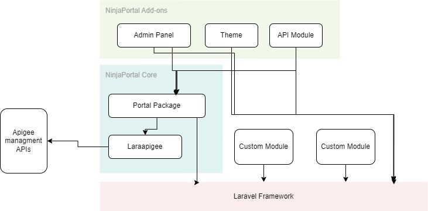

# Architecture of the NinjaPortal 
The ninjaportal is complete solution with a modular architecture,
the core of the ninjaportal is the portal package which is responsible for the core functionality of the portal,
the portal package is built on top of the Laravel framework and it is a composer package that can be installed in any Laravel project. 
also the portal package uses a library built by the authors called [```laraapigee```](https://github.com/lordjoo/laraapigee) to be used as the client to communicate with the Apigee management API.

besides the portal package, the ninjaportal has a set of add-ons that can be installed to extend the functionality of the portal,
the add-ons are also composer packages that can be installed in any Laravel project but they are dependent on the portal package.
<br/>



As shown in the diagram above, the portal package is the core of the ninjaportal, it is responsible for the core functionality of the portal, and providing all support functions for the add-ons and any other customizations that can be added to the portal.

