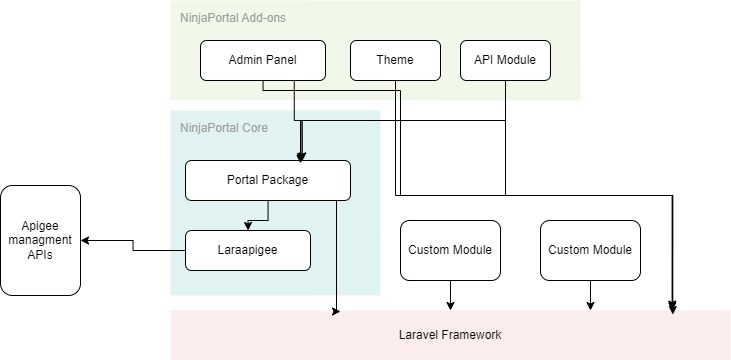

# Architecture

<!-- [[toc]] -->

## Introduction
Ninja Portal features a modular architecture built on Laravel, making it easy to extend and customize. The core package provides essential portal functionality, while add-ons allow you to enhance features as needed.

At its core, the Ninja Portal is a complete solution designed around the `ninjaportal/portal` package, which provides all core features and acts as the backbone of the system. It is built on top of the Laravel framework and can be installed as a Composer package in any Laravel project.

The core package also integrates with a dedicated library called [`laraapigee`](https://github.com/lordjoo/laraapigee), developed by the authors, which serves as the client to communicate with the Apigee Management API.

## Quick Example: Core and Add-ons

The core package is installed via Composer:

```shell
composer require ninjaportal/portal
````

Add-ons, such as the Shadow theme, may be installed as needed:

```shell
composer require ninjaportal/shadow-theme
```

## Architecture Overview



The `ninjaportal/portal` package is the foundation of Ninja Portal. It is responsible for providing all core functionality and supporting add-ons and any other customizations.

Add-ons are also Composer packages that can be installed in any Laravel project; they depend on the core portal package and provide extended functionality. You may install official add-ons or develop your own based on project requirements.

::: tip
You may extend the portal by creating your own add-ons or customizing existing ones.
:::
